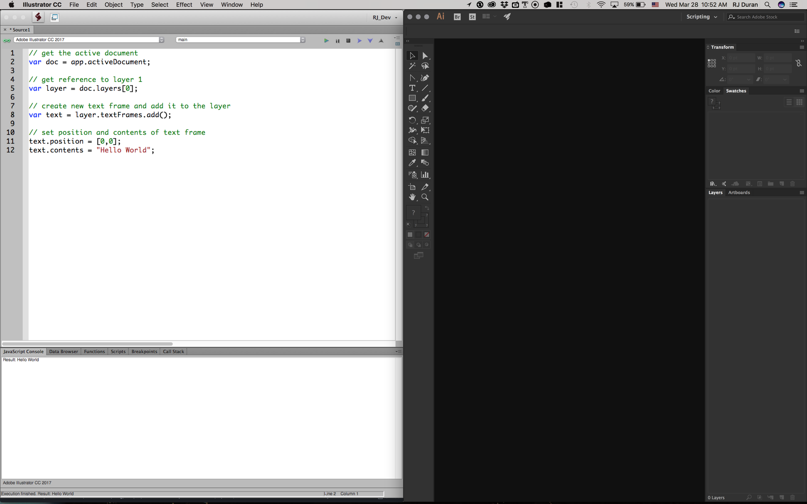
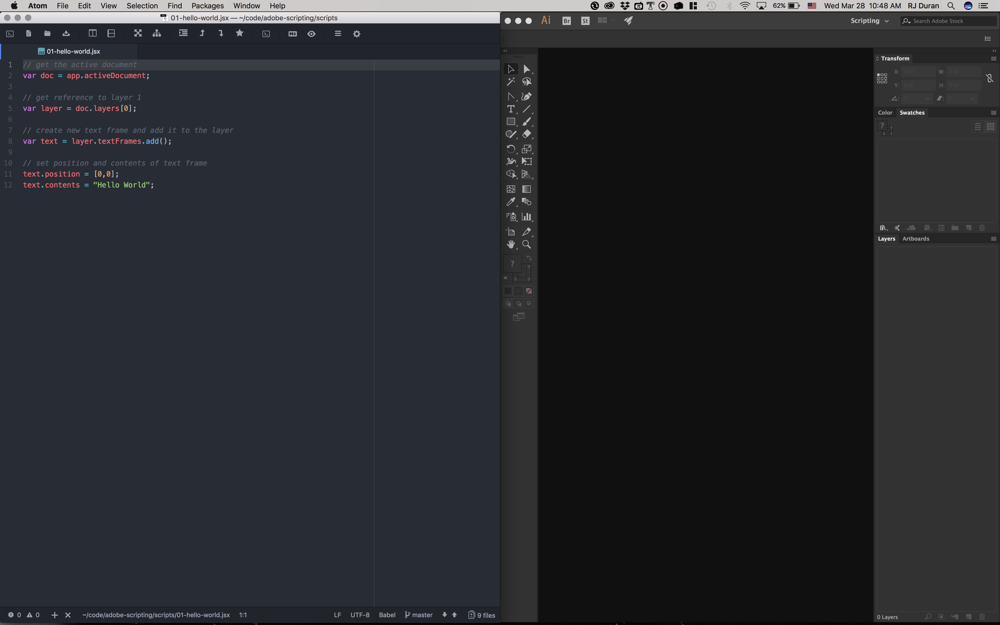
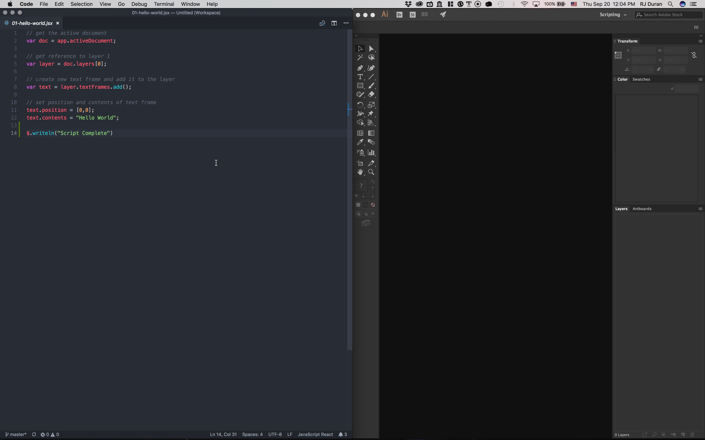
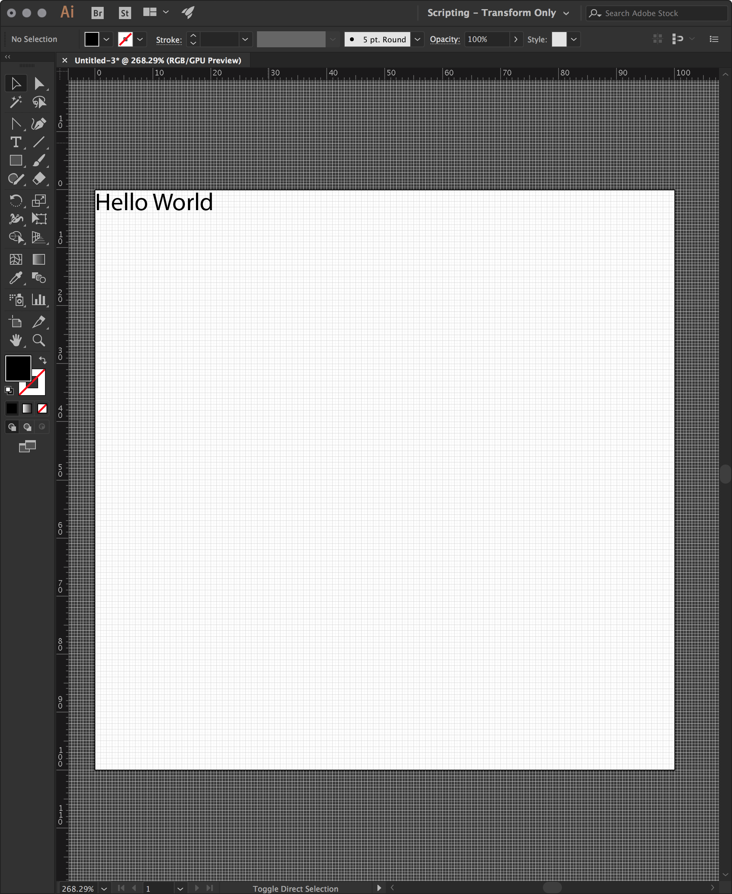

# adobe-scripting

This guide walks through the process of getting started writing scripts in Javascript for use in [Adobe Illustrator CC](https://www.adobe.com/products/illustrator.html).

This tutorial was written using Adobe Illustrator CC (2017) running on macOS (10.12).

## Table of Contents

* [Setup Development Environment](#setup-development-environment)
    * [Install and Setup ExtendScript Toolkit CC](#install-and-setup-extendscript-toolkit-cc)
    * [Install and Setup Atom IDE Based Workflow](#install-and-setup-atom-ide-based-workflow)
    * [Install and Setup VSCode IDE Based Workflow](#install-and-setup-vscode-ide-based-workflow)
* [Getting Started](#getting-started)
    * [Introduction](#introduction)
    * [Understanding the Adobe Documentation](#understanding-the-adobe-documentation)
    * [Setup Development Environment](#setup-development-environment)
    * [Understanding the Document](#understanding-the-document)
    * [Preprocessor Directives](#preprocessor-directives)
    * [Hello World](#hello-world)
    * [Debugging](#debugging)
* [Examples](#examples)
    * [Hello World](#hello-world-1)
    * [New Document](#new-document)
    * [New Document RGB](#new-document-rgb)
    * [New Document Set Origin](#new-document-set-origin)
    * [New Document Preset](#new-document-preset)
    * [New Document Preset Units](#new-document-preset-units)
    * [Primitives](#primitives)
    * [Save Files](#save-files)
    * [Make Document](#make-document)
    * [Preprocessor Directives](#preprocessor-directives)
    * [Layers](#layers)   
* [References](#references)

## Setup Development Environment

There are two ways to write scripts for Adobe Illustrator: 1) Use the ExtendScript Toolkit.app or 2) Use a text editor and custom workflow (ie. Atom). Both workflows are described below.

**Recommendation**: If you are new to scripting or coding in general, I suggest starting with the standard _Extendscript Toolkit.app_ to get familiar with the language, syntax, and DOM before moving onto a different editor and workflow (ie. Atom or VSCode).

Pro Tip: As you become experienced you may find that its beneficial to use both IDEs at times since (in my opinion) Atom (or VSCode) is much nicer to look at / use and ExtendScript Toolkit has a built in Data Browser for learning the API and a JavaScript Console for debugging.

### Install and Setup Extendscript Toolkit CC



1. Launch Adobe CC and look for "Extendscript Toolkit CC" in the list of available applications. If it isn't shown in the list goto Preferences > Creative Cloud > Check "Show Older Apps" to reveal it in the list of available applications. If needed, the direct download link can be found [here](https://helpx.adobe.com/creative-cloud/kb/creative-cloud-apps-download.html).
2. Click Install
3. After installing the toolkit you should see a folder called "Adobe ExtendScript Toolkit CC" under Applications. Locate the folder and launch "ExtendScript Toolkit.app".
4. Set the Target application to "Adobe Illustrator CC 2017". If Illustrator is not open, open it and click the small broken red "chain link" icon in the scripting application to change it green and connect to Illustrator. If Illustrator closes the chain link icon will change back to a broken red link.
5. (Optional) The default settings are much to small for a Macbook Pro with Retina Screen on the highest resolution setting. Change the font to 'Consolas' or 'Monaco' and font size to '16'.

At this point you are ready to write scripts! Keep reading for alternative workflows with Atom or VSCode text editors. Both are free and open source and provide many built in features and packages to customize your workflow.

### Install and Setup Atom IDE Based Workflow

#### Atom Using Process Palette



1. Install [Atom IDE](http://atom.io/)
1. Install [process-palette](https://atom.io/packages/process-palette) atom package.
2. Add a new global command to the process-palette.json file by going to the package setup options and adding the following.
    * Give it a namespace of "ai"
    * An action name of "run-current-script"
    * A keystroke of "cmd-ctrl-r" (You can set this to anything you want)
    * A shell command of `osascript -e 'tell application "Adobe Illustrator"' -e 'activate' -e 'do javascript "#include '{fileAbsPath}'"' -e 'end tell'`    
3. Load a new .jsx file and run it via "cmd + ctrl + r" or by right clicking on the file in the sidebar and choosing "Run With" > Run Current Script.
4. Make sure Adobe Illustrator is open and you should see the results when running the script.

#### Atom Using Adobe Script Runner (Updated!)

As of September 2018, I have shifted the workflow to using [Adobe Script Runner](https://atom.io/packages/adobe-script-runner). Good news! There is a version for both Atom and VSCode (keep reading). It essentially replaces the Process Palette workflow above (Yay!). Which means it works with any kind of file/folder path including spaces or not. By default, it contains a key command setup for After Effects so you will need to do the following to setup a key command for Illustrator.

1. Enable keybindings in the package settings.
2. Open up Atom > Keymap. The file keymap.cson will open in the editor.
3. Add the following key binding for Adobe Illustrator. This one replaces the default AE keybinding. If you want to keep it, just use a different keybinding.

    ```
    '.platform-darwin atom-workspace':
      'alt-cmd-r': 'adobe-script-runner:Adobe Illustrator'
    ```
4. Now you can run scripts with the specified key command as before. If you don't have Illustrator open it will automatically launch it.


### Install and Setup VSCode IDE Based Workflow



1. Install [VSCode IDE](https://code.visualstudio.com/)
2. Install [Adobe Script Runner](https://marketplace.visualstudio.com/items?itemName=renderTom.adobe-script-runner) and [ExtendScript Syntax Highlighting](https://marketplace.visualstudio.com/items?itemName=hennamann.jsx). This second extension will ensure syntax highlighting and that you don't get unnecessary errors when running a .jsx file.
3. Load a new .jsx file and run it via "cmd + shift + p" and selecting Adobe Illustrator. Similarily you could run other Adobe applications the same way.
4. If you would like to customize the key command to be the same as Atom or different than the default, follow the remaining steps.
5. Goto Code > Preferences > Keyboard Shortcuts
6. Search for adobeScriptRunner.ai and add a new key command to this by editing the keybindings.json file or clicking on the pencil next to the item. Add the following keybinding for Adobe Illustrator:

    ```
    {
      "key": "ctrl+cmd+r",
      "command": "adobeScriptRunner.ai",
      "when": "editorTextFocus"
    }
    ```
    
7. Run using the new key command and you should see the results in Illustrator.


## Getting Started

### Introduction

This guide is written with the intention of providing an entry point into learning how to write scripts for use in Adobe Illustrator CC. It assumes some experience with programming fundamentals and JavaScript. If you are familiar with a programming language such as python, C/C++, or Java it should be fairly straightforward to follow along.

The content is oriented towards visual design and writing code that results in visual and graphical elements. If you are familiar with creative coding IDE's such as [Processing](https://processing.org/) or [OpenFrameworks](http://openframeworks.cc/), it should feel familiar in the iterative "write - run ... repeat" workflow, meaning you write some code, run it, see the result in Illustrator, and repeat the process. To facilitate this kind of workflow I recommend using Atom IDE as opposed to the ExtendScript Toolkit Application.

### Understanding the Adobe Documentation

There are several official Adobe documents that act as good references for learning scripting. I suggest reading through them in the following order to grasp fundamental concepts and to learn which references are relevant to the task at hand.

* [Adobe Illustrator Scripting References](https://www.adobe.com/devnet/illustrator/scripting.html) - All Official Documentation (Login Required)
* [Adobe Illustrator Scripting Guide](https://wwwimages2.adobe.com/content/dam/acom/en/devnet/illustrator/pdf/AI_ScriptGd_2017.pdf) - Read First
    * Chapter 2: The Illustrator Scripting Object Model
    * Chapter 3: Scripting Illustrator
    * Chapter 5: Scripting with JavaScript
* [Adobe Illustrator Scripting Reference: Javascript](https://wwwimages2.adobe.com/content/dam/acom/en/devnet/illustrator/pdf/Illustrator_JavaScript_Scripting_Reference_2017.pdf) - Reference as needed
* JavaScript Tools Guide CC (PDF located under _Applications/ExtendScript Toolkit CC/SDK_) / [Online Version](http://estk.aenhancers.com/)
    * Chapter 7: Integrating External Libraries

A searchable and more accessible HTML Version of the **Document Object Model** can be found here [Adobe Illustrator Type Library](https://www.indesignjs.de/extendscriptAPI/illustrator-latest/#about.html). For older versions check 

If you are interested in a more modern approach to working with the documentation and have some experience working with [Node.js](http://nodejs.org/), check out the [Documentation for the ExtendScript API by Yearbook](https://github.com/yearbook/extendscript-api-documentation). It's a great alternative for building your own searchable reference documentation from the ExtendScript API.

### Setup Development Environment

In general, you want to [Setup Atom](#install-and-setup-atom-ide-based-workflow) (one time) and make a new Illustrator document. It is possible to generate new documents using the `app.documents.add()` function. We will cover more of this method later.

* Setup Atom to be your primary editor. Trust me, it just works better.
* Open Up Illustrator
  * Create an Illustrator file with mm as the default units.
      * New Document > Width: 100, Height: 100, Millimeters, RGB Color > Create
  * Setup Grid & Rulers    
      * Preferences > Guides & Grid > Gridline every: 1 mm, Subdivisions: 1
      * Show Grid (View Menu or CMD + ')
      * Show Ruler (View Menu > Rulers or CMD + r)
* Open Up Atom
  * Make a new directory called "scripts".
  * Make a new file called "script.jsx" in your scripts folder. This and other scripts will be used for writing code and running from within Atom via the process-palette package you setup previously.

At this point you should have an empty document in Illustrator with 1 empty layer and a project folder to store scripts in.
    
### Understanding the Document

The most basic scripts consist of drawing paths (and shapes) on layers within a document. To do this there needs to be a reference to an active document and at least one layer within the document. The code below provides a boilerplate to get a reference to the active document and the first (and only) layer in the document.

```javascript
// get the active document
var doc = app.activeDocument;

// get reference to layer 1
var layer = doc.layers[0];
```

Any code entered in a script following these references will have access to the `doc` or `layer` objects.

### Preprocessor Directives

Preprocessor directives are a way to include external scripts. At a basic level, the first line of a script might have a directive as show below. This directive includes any code written in the file lib.js, bringing it into my script. Why use this? Over time your code might get complex, making it hard to read. Using additional files will allow you to modularize, simplify, reuse, and streamline your code. To learn more about their use look at the JavaScript Tools Guide (pdf) located under _Applications/ExtendScript Toolkit CC/SDK_.
```javascript
#include "lib.js"
```

For the moment we won't worry about preprocessor directives. We will make use of them later in the guide.

### Hello World

This example will insert the text "Hello World" at the position (0,0) in the artboard. The position that an object is inserted into the artboard is dependent on the artboard coordinates. When you make a new document using the Illustrator New Document window, the artboard will default to a position of (0,0). This is not always the case when _generating_ an artboard using a script. We will explore why this is next.

1. Create an Illustrator file with mm as the default units. Set the document size to 100 mm x 100 mm and RGB Color. As mentioned previously, its really nice to be able to see the grid while learning about positioning and inserting objects to the artboard. Setup the grid by going to Preferences > Guides & Grid > Gridline every: 1 mm, Subdivisions: 1.

2. Create a script called hello-world.jsx and insert the following code.

    ```javascript
    // get the active document
    var doc = app.activeDocument;

    // get reference to layer 1
    var layer = doc.layers[0];

    // create new text frame and add it to the layer
    var text = layer.textFrames.add();

    // contents and position of text frame    
    text.contents = "Hello World";
    text.position = [0,0];
    ```

3. Run the code using Process Palette to see the result in Illustrator. The text was placed in the top left corner at (0,0).



### Debugging

The `$.writeln()` function - This is similar to `println()` in Processing or `console.log()` in standard JavaScript and is really useful for debugging. The only caveat is it only works in the ExtendScript Toolkit IDE and will print to the JavaScript Console within the IDE. I have not found a solution for printing debug messages to the console in Atom yet. To make use of it, you can have the ExtendScript Toolkit open next to Atom.
```javascript
$.writeln("Foo Goo!");
```

Data Browser - This window within the ExtendScript Toolkit IDE is shows the namespace and all the objects, variables, and methods available. It is only available within the ExtendScript Toolkit IDE and only updates when running a script. In general the typical use case involves a document and/or layer so I usually start off inspecting an active document using the following script. In many cases, it's probably much easier to reference a documentation system such as [Documentation for the ExtendScript API by Yearbook](https://github.com/yearbook/extendscript-api-documentation).
```javascript
var doc = app.activeDocument;
var layer = doc.layers[0];
```

## Examples

This section describes the examples contained in the `scripts` folder. The best way to learn the API is to work through these examples starting from the top.

### Hello World

This example assumes there is an active document open in Illustrator. It gets a reference to the document, the first layer in the document, then adds a textFrameItem to the textFrames collection. A reference to the textFrameItem added is then positioned at 0,0 and given the contents of "Hello World".

Assuming the document was created from the new file menu, it will have an origin of the top left, meaning both the world coordinates and artboard coordinates will align. As such, the text should be drawn in the top left corner.

```javascript
// get the active document
var doc = app.activeDocument;

// get reference to layer 1
var layer = doc.layers[0];

// create new text frame and add it to the layer
var text = layer.textFrames.add();

// set position and contents of text frame
text.position = [0,0];
text.contents = "Hello World";  
```

### New Document

This example creates a new document with a width of 100 pt and height of 100 pt and adds a pointTextItem to the textFrames collection. Points are the default unit in Illustrator.

```javascript
// define the document width (in points)
var width = 100;

// define the document height (in points)
var height = 100;

// create a new document; Defaults to CMYK colorspace
var doc = app.documents.add(null, width, height);

// add text to it
var text1 = doc.textFrames.pointText( [10, 0] );

// the text
text1.contents = "Hello World";
```

### New Document RGB

This example is the same as the previous but shows how to change the colorspace of the file from the default CMYK to RGB.

```javascript
// define the document width (in points)
var width = 100;

// define the document height (in points)
var height = 100;

// create a new document; Set to RGB colorspace
var doc = app.documents.add(DocumentColorSpace.RGB, width, height);

// add text to it
var text1 = doc.textFrames.pointText( [10, 0] );

// the text
text1.contents = "Hello World";
```

### New Document Set Origin

This example creates a new document with a width of 100 pt and height of 100 pt and adds a pointTextItem to the textFrames collection. Before adding the text object we shift the ruler origin for the document such that the origin is in the top left. This is different from when we create a document using the standard new file menu. In two previous examples, you may notice the location of the text inserted is at or near the bottom of the artboard. This is because when generating a new document with a script, Illustrator will default to the bottom left as the origin instead of the top left.

```javascript
// define the document width (in points)
var width = 100;

// define the document height (in points)
var height = 100;

// create a new document
var doc = app.documents.add(DocumentColorSpace.RGB, width, height);

// shift the zero-point of the rulers in the document relative to the bottom left of the document. Basically, make (0,0) of the artboard the top left corner to make it easier to position objects.
doc.rulerOrigin = [0,height];

// add text to it
var text1 = doc.textFrames.pointText( [0, 0] );

// the text
text1.contents = "Hello World";
```

### New Document Preset

This example makes use of the DocumentPreset() function to setup a new document. This allows you to customize things like the document title, width, height, and colorspace. It also allows you to make use of built in Illustrator presets for documents (which I rarely find myself using).

```javascript
// define the document width (in points)
var width = 100;

// define the document height (in points)
var height = 100;

var presets = app.startupPresetsList;

/*
  To get list of presets:
  var presets = app.startupPresetsList;
  $.writeln(presets);
  Returns: Art & Illustration,Basic RGB,Devices,Film and Video,Mobile,Print,Video and Film,Web
*/

var preset = presets[0];

var docPreset = new DocumentPreset();
docPreset.title = "MyNewDocument"; // Untitled by default
docPreset.width = width;
docPreset.height = height;
docPreset.colorMode = DocumentColorSpace.RGB;

// create a new document
var doc = app.documents.addDocument(preset, docPreset,false);
```

### New Document Preset Units

This example builds on the previous one and includes a scaling factor to change the document units from Points to Millimeters. I find the easiest way to deal with unit conversion is to just multiply or divide by the scaling factor. In this case its `2.834645` so we just declare a global variable called `PTS_MM` to reference as needed. The document units are also specified in the `docPreset` as Millimeters.

```javascript
var PTS_MM = 2.834645;

// define the document width (in mm)
var width = 100 * PTS_MM;

// define the document height (in mm)
var height = 100 * PTS_MM;

var presets = app.startupPresetsList;

/*
  To get list of presets:
  var presets = app.startupPresetsList;
  $.writeln(presets);
  Returns: Art & Illustration,Basic RGB,Devices,Film and Video,Mobile,Print,Video and Film,Web
*/

var preset = presets[0];

var docPreset = new DocumentPreset();
//docPreset.title = "MyNewDocument"; // Untitled by default
docPreset.width = width;
docPreset.height = height;
docPreset.colorMode = DocumentColorSpace.RGB;
docPreset.units = RulerUnits.Millimeters; //  set the ruler units to mm

// create a new document
var doc = app.documents.addDocument(preset, docPreset, false);

// shift origin
doc.rulerOrigin = [0,height];

// insert drawing code here
// the document is setup with origin (0,00 in the top left corner. Note: Positioning in the y direction is negative (ie -y).
```

### Primitives

This example covers the basics of drawing and styling primitive shapes such as rectangles, rounded rectangles, ellipses, lines, and closed paths. It also introduces a preprocessor directive to include some helper functions for working with color.

```javascript
#include "../lib/color.js"

// define the document width (in points)
var width = 100;

// define the document height (in points)
var height = 100;

// create a new document
var doc = app.documents.add(DocumentColorSpace.RGB, width, height);

// shift origin
doc.rulerOrigin = [0,height];

// add to existing layer
var layer = doc.layers[0];

// coordinates (in points)
var y = 0;
var x = 0;
var w = 10;
var h = 10;

// draw rectangle
var rect = layer.pathItems.rectangle(-y, x, w, h);
rect.fillColor = makeColorRGB(0,0,255);
rect.stroked = false;

// draw rounded rectangle
var roundRect = layer.pathItems.roundedRectangle(-y, x + 10, w, h, 1, 1, false);
roundRect.fillColor = makeColorRGB(255,0,0);
roundRect.stroked = false;

// draw ellipse
var ellipse = layer.pathItems.ellipse(-y, x+20, w, h);
ellipse.fillColor = makeColorRGB(0, 255, 0);
ellipse.stroked = false;

// draw line
var p = layer.pathItems.add();
var lineList = new Array([10, -20],[20, -20]);
p.setEntirePath(lineList);
p.filled = false;
p.strokeWidth = 1;
p.strokeColor = makeColorRGB(0,0,255);
  
// draw closed path
var p = layer.pathItems.add();
var lineList = [
  [30, -20],
  [50, -30],
  [40, -15]
];
p.setEntirePath(lineList);
p.closed = true;
p.filled = false;
p.strokeCap = StrokeCap.ROUNDENDCAP;
p.strokeJoin = StrokeJoin.ROUNDENDJOIN;
p.strokeWidth = 2;
```

[lib/color.js](/lib/color.js)
```javascript
// Represents the "none" color. Assigning a NoColor object to the fill or stroke color of an art item is equivalent to setting the filled or stroked property to false.
function noColor() {
  return new NoColor();
}
// necessary since RGBColor class has no constructor
function makeColorRGB(r,g,b){
    var c = new RGBColor();
    c.red   = r;
    c.green = g;
    c.blue  = b;
    return c;
}

// necessary since CMYKColor class has no constructor
function makeColorCMYK(c,m,y,k){
    var ink = new CMYKColor();
    ink.cyan   = c;
    ink.magenta = m;
    ink.yellow  = y;
    ink.black  = k;
    return ink;
}
```

### Save Files

This example covers how to programmatically save files in a different formats and for different versions of Illustrator. It creates a directory called "test" and saves out the following file types: AI, PDF, EPS, JPG, PNG, and SVG. Helper functions for each file type can be found in the /lib/files.js file.

```javascript
#include "../lib/color.js"
#include "../lib/files.js"
//#include "../lib/utils.js"

// define the document width (in points)
var width = 100;

// define the document height (in points)
var height = 100;

// create a new document
var doc = app.documents.add(DocumentColorSpace.RGB, width, height);

// shift origin
doc.rulerOrigin = [0,height];

// add to existing layer
var layer = doc.layers[0];

// coordinates (in points)
var y = 0;
var x = 0;
var w = 10;
var h = 10;

// draw rectangle
var rect = layer.pathItems.rectangle(-y, x, w, h);
rect.fillColor = makeColorRGB(0,0,255);
rect.stroked = false;

// draw rounded rectangle
var roundRect = layer.pathItems.roundedRectangle(-y, x + 10, w, h, 1, 1, false);
roundRect.fillColor = makeColorRGB(255,0,0);
roundRect.stroked = false;

// draw ellipse
var ellipse = layer.pathItems.ellipse(-y, x + 20, w, h);
ellipse.fillColor = makeColorRGB(0, 255, 0);
ellipse.stroked = false;

// specify output dir and filename
var dirName = "test";
var fileName = "output";
//var fileName = "output-" + dateTimeStr(); // utils.js include required

// make a new directory if needed
var dir = new Folder('~/Desktop/' + dirName);
if (!dir.exists) {
  dir.create();
}

// save ai file
saveAI(dir + "/" + fileName + ".ai"); // default
saveAI(dir + "/" + fileName + "-cc" + ".ai", "CC");
saveAI(dir + "/" + fileName + "-cs6" + ".ai", "CS6");
saveAI(dir + "/" + fileName + "-cs2" + ".ai", "CS2");
// saveAI("~/Desktop/output-cc.ai", "CC");
// saveAI("~/Desktop/output-cs6.ai", "CS6");
// saveAI("~/Desktop/output-cs2.ai", "CS2");

// save pdf file
savePDF(dir + "/" + fileName + ".pdf"); // default

// save eps file
saveEPS(dir + "/" + fileName + ".eps"); // default
//saveEPS(dir + "/" + fileName + "-cc" + ".eps", "CC");
//saveEPS(dir + "/" + fileName + "-cs6" + ".eps", "CS6");
//saveEPS(dir + "/" + fileName + "-cs2" + ".eps", "CS2");
// saveEPS("~/Desktop/output-cc.eps", "CC");
// saveEPS("~/Desktop/output-cs6.eps", "CS6");
// saveEPS("~/Desktop/output-cs2.eps", "CS2");

// save jpg
saveJPG(dir + "/" + fileName + ".jpg"); // default
saveJPG(dir + "/" + fileName + "-2x" + ".jpg", 2); // scaled by 2
saveJPG(dir + "/" + fileName + "-4x" + ".jpg", 4); // scaled by 4
// saveJPG("~/Desktop/output-2x.jpg", 2); // scaled by 2
//saveJPG("~/Desktop/output-4x.jpg", 4); // scaled by 4

// save png
savePNG(dir + "/" + fileName + ".png", 1, false); // default
savePNG(dir + "/" + fileName + "-2x" + ".png", 2, false); // scaled by 2
savePNG(dir + "/" + fileName + "-4x" + ".png", 4, false); // scaled by 4

// save svg
saveSVG(dir + "/" + fileName + ".svg"); // default
```

### Make Document

This example demonstrates a way to simplify the document creation process. It makes it easy to define a width, height, and units for a new document in one line. Helper functions can be found in the /lib/doc.js file.

```javascript
#include "../lib/units.js"
#include "../lib/doc.js"

// make new doc in pts (default)
var doc = makeDocument(100, 100);

// make new doc in mm
//var doc = makeDocument(100, 100, "MM");

// make new doc in cm
//var doc = makeDocument(100, 100, "CM");

// make new doc in inches
//var doc = makeDocument(100, 100, "IN");
```

### Preprocessor Directives

This example demonstrates how to include a single "library" file called main.js using the #include preprocessor directive. main.js in turn includes other js files.

```javascript
#include "../lib/main.js"

// This preprocessor directive at the top of the file includes functionality from the lib/main.js file.
```

### Layers

This example demonstrates how to work with layers. It creates a document, several layers, then adds primitives to the layers. It proceeds to manipulate layer names, colors, and layer state (locked / unlocked).


```javascript
#include "../lib/color.js"

// define the document width (in points)
var width = 100;

// define the document height (in points)
var height = 100;

// create a new document
var doc = app.documents.add(DocumentColorSpace.RGB, width, height);

// shift origin
doc.rulerOrigin = [0,height];

// add new layers
// layers are appended to the front of the array, meaning, each layer added is in layers[0].
var layer1 = doc.layers[0]; // default layer for new document
var layer2 = doc.layers.add();
var layer3 = doc.layers.add();
doc.layers.add(); // add "Layer 4"
doc.layers.add(); // add "Layer 5"

// doc.layers by 5th add()
// [0] Layer 5
// [1] Layer 4
// [2] Layer 3
// [3] Layer 2
// [4] Layer 1

// access "Layer 4" in position 1
var layer4 = doc.layers[1];

// access "Layer 5" in position 0 and rename it
var layer5 = doc.layers[0];
layer5.name = "myLayer";

doc.layers.add(); // add "Layer 6"
// access "Layer 6" in position 0 and lock it
var layer6 = doc.layers[0];
layer6.locked = true;

// make 3 more layers ("Layer 7, 8, 9")
for (var i = 0; i < 3; i++) {
  doc.layers.add();
}

// make 3 more layers ("Layer 10, 11, 12") and change color
for (var i = 0; i < 3; i++) {
  var layer = doc.layers.add();
  layer.color = makeColorRGB(255, 255, 0);
  layer.locked = i == 1 ? true : false; // if i == 1, set to true (Result: Lock "Layer 11")
}

// make 4 more layers ("Layer 13, 14, 15, 16") and conditional rename with a range
for (var i = 0; i < 4; i++) {
  var layer = doc.layers.add();
  layer.color = makeColorRGB(255, 100, 0);
  //layer.name = "my_layer_" + (13 + i);
  layer.name = i == 2 ? "foo" : "my_layer_" + (13 + i); // if i == 2, set name to "foo" else "my_layer_##"
}

// coordinates (in points)
var y = 0;
var x = 0;
var w = 10;
var h = 10;

// draw rectangle
var rect = layer1.pathItems.rectangle(-y, x, w, h);
rect.fillColor = makeColorRGB(0,0,255);
rect.stroked = false;

// draw rounded rectangle
var roundRect = layer2.pathItems.roundedRectangle(-y, x + 10, w, h, 1, 1, false);
roundRect.fillColor = makeColorRGB(255,0,0);
roundRect.stroked = false;

// draw rectangle
var rect = layer3.pathItems.rectangle(-y - 20, x + 20, w, h);
rect.fillColor = makeColorRGB(0,0,0);
rect.stroked = true;
rect.strokeColor = makeColorRGB(255,0,0);
rect.strokeWidth = 1;

// draw ellipse
var ellipse = layer4.pathItems.ellipse(-y, x + 30, w, h);
ellipse.fillColor = makeColorRGB(0, 255, 0);
ellipse.stroked = false;
```

### Future Examples

* Text
* Groups
* Iteration
* Shape Grids
* Line Grids
* Text Types
* Working with Data

And more!

## References

### Illustrator Scripting

* [Adobe Illustrator CC 2017 Scripting References](https://www.adobe.com/devnet/illustrator/scripting.html)
* [Adobe Illustrator CC 2017 Scripting Guide](https://wwwimages2.adobe.com/content/dam/acom/en/devnet/illustrator/pdf/AI_ScriptGd_2017.pdf) (pdf)
    * Chapter 5: Scripting with JavaScript
* [Adobe Illustrator CC 2017 Scripting Reference: Javascript](https://wwwimages2.adobe.com/content/dam/acom/en/devnet/illustrator/pdf/Illustrator_JavaScript_Scripting_Reference_2017.pdf) (pdf)
* ExtendScript Toolkit ReadMe.pdf (Found under Applications/Adobe ExtendScript Toolkit CC)
* [Illustrator Scripting Guide](http://ai.aenhancers.com/) by aenhancers
* [Adobe Illustrator Scripting Forum](https://forums.adobe.com/community/illustrator/illustrator_scripting)
* [Illustrator Object Model](http://cssdk.s3-website-us-east-1.amazonaws.com/sdk/1.0/docs/WebHelp/app_notes/AI_obj_model.htm) aka DOM
* [Graphic Design Stack Exchange](https://graphicdesign.stackexchange.com/tags/illustrator-scripting/hot)
* Sample Code
    * Found under Applications/Adobe Illustrator CC/Scripting/Sample Scripts/JavaScript
* Tutorials
    * [scripting-for-illustrator-tutorial](https://github.com/jtnimoy/scripting-for-illustrator-tutorial) by [JT Nimoy](http://jtnimoy.com/) ([jtnimoy](https://github.com/jtnimoy))
    * [Use AppleScript to perform batch actions in Illustrator](https://gielberkers.com/use-applescript-batch-actions-illustrator/)
* Tools
    * [Adobe CC Scripts Panel](https://github.com/majman/adobe-scripts-panel)

### ExtendScript

* [ExtendScript References And Links](https://github.com/ExtendScript/wiki/wiki/References-And-Links) - Useful resources for scripting
* [Adobe Illustrator Type Library](https://www.indesignjs.de/extendscriptAPI/illustrator-latest/#about.html)
* [Documentation for the ExtendScript API by Yearbook](https://github.com/yearbook/extendscript-api-documentation) - Great alternative for building your own reference documentation from the ExtendScript API.

### UI Scripting

* JavaScript Tools Guide CC (Found under Applications/ExtendScript Toolkit CC/SDK)
* [JavaScript Tools Guide (Online)](http://estk.aenhancers.com/) - A great reference on other topics such as UI Tools, Interapplication Communication, etc
* [Jongware ScriptUI](http://jongware.mit.edu/scriptuihtml/Sui/index_1.html)
* [Jongware Illustrator (CS6)](http://jongware.mit.edu/iljscs6html/iljscs6/)
* [Peter Kahrel's ScriptUI for Dummies](http://www.kahrel.plus.com/indesign/scriptui.html)
* Sample Code
    * ScriptUI Samples (Found under Applications/ExtendScript Toolkit CC/SDK/Samples)

### Atom IDE Based Workflow

* [process-palette](https://atom.io/packages/process-palette) atom package
* Apple Scripting
    * [Apple Scripting](https://developer.apple.com/library/content/documentation/AppleScript/Conceptual/AppleScriptLangGuide/introduction/ASLR_intro.html)
    * [Creating a Script](https://developer.apple.com/library/content/documentation/LanguagesUtilities/Conceptual/MacAutomationScriptingGuide/CreateaScript.html#//apple_ref/doc/uid/TP40016239-CH12-SW1)
    * [The Ultimate Beginner's Guide To AppleScript](https://computers.tutsplus.com/tutorials/the-ultimate-beginners-guide-to-applescript--mac-3436)
* osascript
    * [osascript manual](https://ss64.com/osx/osascript.html)
    * [Run AppleScript from the Command Line in Mac OS X with osascript](http://osxdaily.com/2016/08/19/run-applescript-command-line-macos-osascript/)


